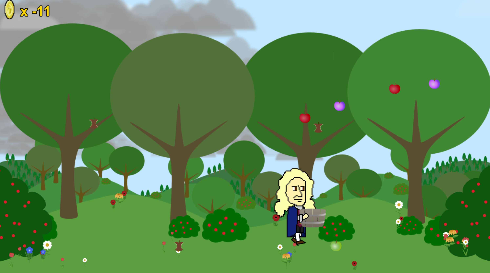

## Intro
A game I made in order to learn a JavaScript, Phaser.js, Inkscape, Audacity, Gimp, and Git.

##Where to Play.
- [Here on Github](http://theqyd.github.io/apple-catch).
- Clone it and add it to your webserver.
- Download it. Unzip it. Add it to your webserver.

## How to Play.
Catch the apples and avoid obstacles.

# Rules.
1. Avoid anything that isn't an apple. 
2. The more apples you catch, the more apples will fall. 
3. The more apples fall, the more bad apples fall.

# Items
- Purple Apples: Newton's controls are in reverse.
- Rotten Apples: Newton looses points.
- Other Apples:Newton

# Environment
- Day: Normal gameplay.
- Night: Newton stays in the air longer when he jumps.
- Rain: Newton slides on the ground.

## Credits.
- Code: Qasim Dove <emailqasim@gmail.com>
- Graphics: Qasim Dove <emailqasim@gmail.com>
- Music: Kevin MacLeod <kevin@incompetech.com>

## Misc
You can play the original I made in Scratch right [here](https://scratch.mit.edu/projects/10484429)
